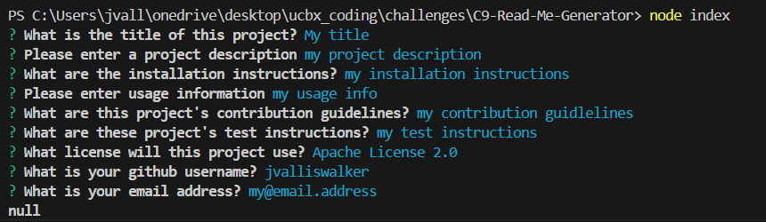
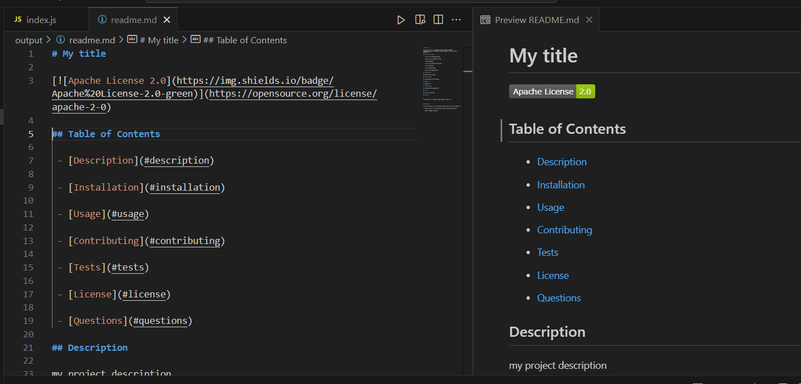

# C9-Read-Me-Generator

## Description
This project is a nodejs command-line program the takes user input and uses it to create a standardized README.md file which can be used in github projects.

## Video & Screenshots

https://github.com/user-attachments/assets/7f58a5b8-76a6-4d75-82ec-a23de67bd0b7

